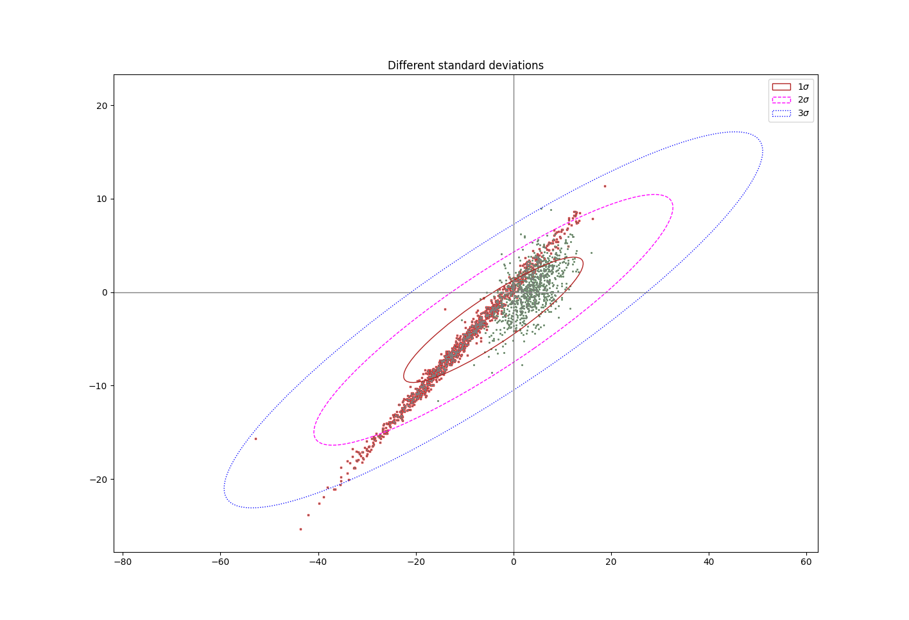

# Session 3 project
## Participants:
- Nikolaos Gkloumpos
- Malthe H. Boelskift
- Louis Ildal
- Guillermo V. Gutierrez-Bea

## Overall description
We are given the train data, trn_x and trn_y along with their class labels, and using the test data and their respective class labels,trn_x_class and trn_y_class we gain different results as output for each exercise, which can be seen below. The overall task of these exercises is a classification problem, which our model needs to be able to identify.

Using matplotLib we can get an idea for the groups and their distribution.



### About the scripts
Functions used for plotting data, as well as common operations such as **plotting graphs** and **computing likelihood** were moved to separate files called `statsHelp.py` and `plottingFunctions` to improve clarity.

Each script runs independently and solves it's corresponding accuracy, `nominalGroupGraph.py` can be used to get an overview of the data.

## Excersise 1
 Classify instances in tst_xy, and use the corresponding label file tst_xy_class to calculate the accuracy

Output from excersise 1:
```Python
Total training samples: 12163
True Positives: 1062
False Positives: 73
Accuracy: 0.9356828193832599
ErrorRate: 0.06431718061674009
```

## Excersise 2
 Classify instances in tst_xy_126 by assuming a uniform prior over the space of hypotheses, and use the corresponding label file tst_xy_126_class to calculate the accuracy
 
Output from excersise 2:

```Python
Total training samples: 12163
True Positives: 1120
False Positives: 141
Accuracy: 0.8881839809674861
ErrorRate: 0.11181601903251388
```


## Excersise 3
Classify instances in tst_xy_126 by assuming a prior probability of 0.9 for Class x and 0.1 for Class y, and use the corresponding label file tst_xy_126_class to calculate the accuracy; compare the results with those of (exercise 2)

Output from excersise 3:
```Python
Total training samples: 12163
True Positives: 1214
False Positives: 47
Accuracy: 0.9627279936558287
ErrorRate: 0.03727200634417129
```

Comparing the results of this exercise with the ones from the previous one we realised how the prior affects the posterior probability and consequently the acuracy of the classification. This highlights the importance of the prior in classification and shows that the posterior probability can be a more riliable indicator than the likelyhood for classification.